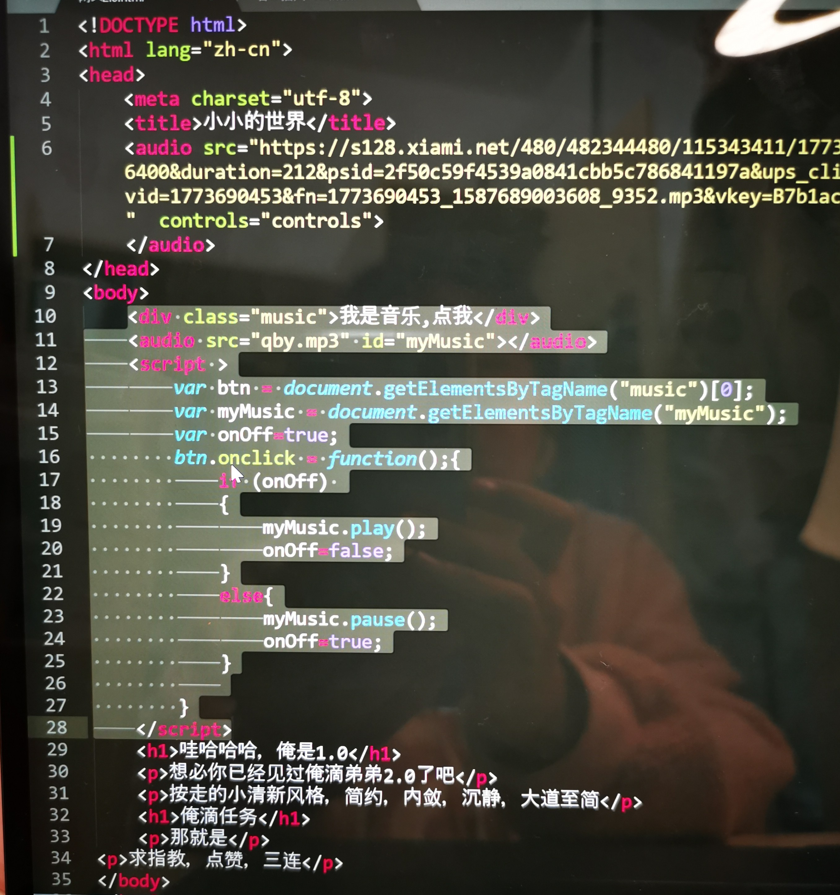
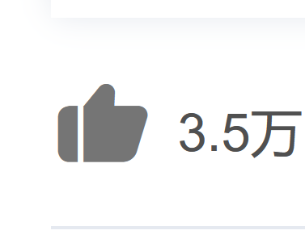
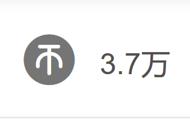
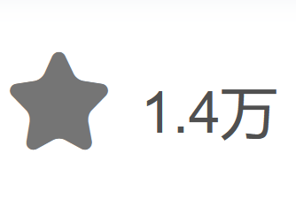

<!DOCTYPE html>
<html lang="zh-cn">
<head>
	<meta charset="utf-8">
	<title>小小的世界</title>
	<audio src="https://s128.xiami.net/480/482344480/115343411/1773690453_1587689003608_9352.mp3?ccode=xiami__&expire=86400&duration=212&psid=2f50c59f4539a0841cbb5c786841197a&ups_client_netip=null&ups_ts=1602844262&ups_userid=0&utid=&vid=1773690453&fn=1773690453_1587689003608_9352.mp3&vkey=B7b1ac9a320d45659cb86e615b7bd1de1" width="330" height="450"  controls="controls">
	</audio>
<body>
	<h1>哇哈哈哈，俺是1.0</h1>
	
想必你已经见过俺滴弟弟2.0了吧

	
按走的小清新风格，简约，内敛，沉静，大道至简

	<h2>俺滴任务</h2>
	
那就是

求指教，点赞，三连

	
用Js音乐没法播放，救救孩子吧wx15843998689

<h3 onclick=myFunction()>。</h3>
<table>
	<td ></td>
	<td></td>
	<td> </td>

</table>

</body>
</html>

