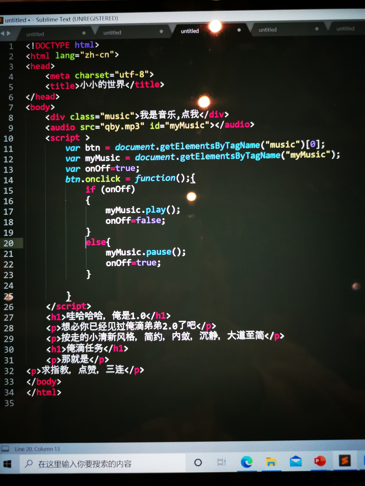

<!DOCTYPE html>
<html lang="zh-cn">
<head>
	<meta charset="utf-8">
	<title>小小的世界</title>
</head>
<body>
	
我是音乐,点我

	<audio src="qby.mp3" id="myMusic"></audio>
	
	<h1>俺是1.0</h1>
	
想必你已经见过俺滴弟弟2.0了吧

	
俺走的小清新风格，简约，内敛，沉静，大道至简

	<h1>俺滴任务</h1>
	
那就是

求指教，俺音乐播不了（哭）是Js不对吗

</body>
</html>
